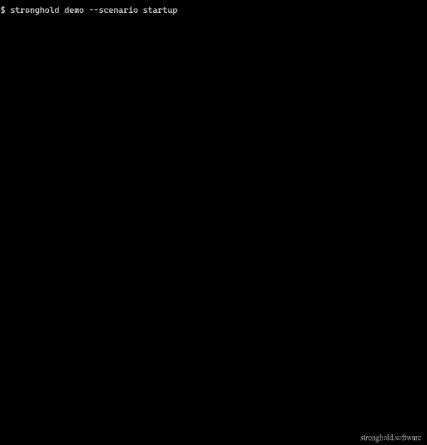

[](https://github.com/mehdi-arfaoui/stronghold/actions/workflows/ci.yml)
[](https://www.npmjs.com/package/@stronghold-dr/cli)
[](https://www.gnu.org/licenses/agpl-3.0)
[](https://www.typescriptlang.org/)

# Stronghold

**Open-source disaster recovery readiness system for cloud infrastructure.**

Stronghold turns disaster recovery from static documentation into a living, evidence-backed, scenario-aware system.

It tells you not only what is wrong, but which critical service is no longer recoverable, why, whether the runbook still matches reality, and how your DR posture is evolving over time.

The system is service-centric, evidence-backed, scenario-aware, runbook-validating, posture-tracking, and governance-aware.

> Disaster recovery is usually documented once and trusted for months.  
> Stronghold keeps it alive by continuously mapping services, validating assumptions, tracking evidence, checking scenario coverage, and detecting when recovery paths degrade.

> Stronghold is read-only by design. It never modifies your infrastructure, sends no telemetry, and can run entirely in your environment.

<p align="center">
  
</p>

## What Stronghold is now

Stronghold is no longer just:

- a cloud scanner
- a dependency graph
- a DR score
- a YAML DR plan generator

It is a system that helps teams answer five questions:

1. What do we actually have?
2. What breaks if this fails?
3. Do we still have a viable recovery path?
4. What evidence supports that belief?
5. Has our DR posture improved or degraded over time?

Stronghold has moved from resource-centric inventory to service-centric recoverability, from static checks to contextualized findings, from score-only output to scenario coverage, from config presence to evidence maturity, from one-off snapshots to posture memory, and from static DR documents to living runbooks that can be checked against current infrastructure.

## The problem

Most DR tooling stops at configuration checks or static documentation.

Teams may know that backups exist, but not whether critical services are still recoverable, whether recovery paths still match the live environment, whether the recorded evidence is fresh, or whether a previously accepted risk has quietly become dangerous again.

Infrastructure changes constantly. Backup and failover settings are useful, but they are not the same as proven recoverability. Without a living view, teams lack a reliable way to track service recovery coverage, scenario readiness, runbook validity, proof freshness, and regressions over time.

## What Stronghold does

1. **Service-centric DR model.** Stronghold maps cloud resources into services and workloads using CloudFormation signals, application tags, naming patterns, topology, and manual declarations. It reasons about recoverability at the service level, not just the resource level.
2. **Contextualized findings.** A finding is not just "RDS has no backup." Stronghold attaches technical impact, DR impact, affected scenarios, and prioritized remediation so the issue is actionable in operational terms.
3. **Evidence-backed posture.** Stronghold tracks `observed`, `inferred`, `declared`, `tested`, and `expired` evidence. It distinguishes "configuration was seen" from "recovery was tested" and surfaces freshness instead of pretending proof is stronger than it is.
4. **Scenario coverage analysis.** Stronghold evaluates built-in disruption scenarios such as AZ failure, region failure, SPOF failure, and data corruption, then marks coverage as `covered`, `partially_covered`, `uncovered`, or `degraded`.
5. **Runbook liveness.** Stronghold generates DR plans and executable runbooks, then checks whether referenced resources still exist and still match the current environment. It flags stale recovery assumptions before an incident exposes them.
6. **Temporal posture memory.** Stronghold keeps history, tracks recurring and aging findings, calculates DR debt, highlights expiring evidence and accepted risks, and shows whether posture is improving, stable, or degrading.

Stronghold does not just tell you that something is misconfigured. It tells you which critical service is now at risk, which scenarios are no longer covered, whether the runbook still matches reality, and how long the gap has existed.

## Key concepts

- **Service.** A logical workload composed of multiple cloud resources that must recover together.
- **Finding.** A contextualized DR issue with technical impact, recovery impact, scenario impact, and remediation guidance.
- **Evidence.** Support for a DR claim, classified as `observed`, `inferred`, `declared`, `tested`, or `expired`.
- **Scenario coverage.** Whether a plausible failure scenario still has a viable and current recovery path.
- **DR debt.** Accumulated unresolved recovery risk over time, weighted by severity, age, service criticality, and recurrence.

## Example: from static check to living DR posture

Old world:

> "RDS instance `payment-db` has no backup."

Stronghold view:

```text
Service: payment
DR debt: 680
Critical finding unresolved for 45 days

Scenario coverage
- AZ failure: uncovered
- Data corruption: uncovered
- Region failure: partially covered

Evidence
- backup retention: observed as disabled
- last restore test: expired
- runbook liveness: broken (references missing replica `payment-db-dr`)

Next action
1. Enable automated backups
2. Register a restore test
3. Regenerate and validate the payment runbook
```

## Quick start

Try the built-in demo first:

```bash
npx @stronghold-dr/cli demo
```

Then run it on a real environment:

```bash
npx @stronghold-dr/cli scan --region eu-west-1
npx @stronghold-dr/cli status
npx @stronghold-dr/cli report
npx @stronghold-dr/cli scenarios
npx @stronghold-dr/cli plan generate > drp.yaml
npx @stronghold-dr/cli plan runbook > runbook.yaml
```

Useful follow-up:

```bash
npx @stronghold-dr/cli iam-policy > stronghold-policy.json
npx @stronghold-dr/cli history
```

Notes:

- Stronghold is read-only and makes no AWS changes.
- Results get stronger with broader read-only IAM visibility.
- Some service boundaries, dependencies, and scenario effects may be inferred with varying confidence. Stronghold surfaces that uncertainty instead of hiding it.
- Stronghold supports account-aware configuration, but each scan evaluates one AWS account at a time.

Start with [docs/getting-started.md](docs/getting-started.md) for the full walkthrough.

## Why Stronghold is different

- Service-centric, not resource-only
- Scenario coverage, not just checklist findings
- Evidence maturity, not just config presence
- Living runbooks, not static DR documents
- Temporal DR posture, not one-time scan results
- Explicit uncertainty, not fake precision
- Self-hosted, auditable, and zero telemetry

| Capability | Generic cloud scanner | Stronghold |
| --- | --- | --- |
| Resource checks | Yes | Yes |
| Service model | Usually no | Yes |
| Scenario coverage | Usually no | Yes |
| Evidence maturity | Usually shallow | Yes |
| Runbook validation | Rare | Yes |
| DR debt tracking | Rare | Yes |
| Open source | Sometimes | Yes |
| Self-hosted | Sometimes | Yes |

## Architecture

```text
CLI / Web / GitHub Action
          |
          v
Discovery -> Service Model -> Graph & Confidence
                         -> Findings Engine
                         -> Evidence Engine
                         -> Scenario Coverage Engine
                         -> Runbook Validation
                         -> Posture Memory
                         -> Governance Layer
          |
          v
Local Files / PostgreSQL / Audit Trail
```

- **Discovery.** Read-only AWS scanners normalize infrastructure metadata across 16 services.
- **Service model and graph.** Resources are grouped into services and linked through dependency analysis with explicit confidence limits.
- **Findings and evidence.** Validation rules generate contextual findings and attach evidence maturity rather than binary certainty.
- **Scenario and runbooks.** Built-in scenarios evaluate coverage, while generated plans and runbooks are validated against current state.
- **Posture memory and governance.** History, finding lifecycle, DR debt, declared ownership, risk acceptances, and policy checks provide continuity between scans.
- **Storage and audit.** CLI artifacts live under `.stronghold/`; self-hosted mode persists shared state in PostgreSQL. Audit logging is always on.

See [docs/architecture.md](docs/architecture.md) for the detailed package and pipeline view.

## What Stronghold proves - and what it does not

Stronghold can prove or support:

- observed infrastructure configuration
- inferred dependency and service hypotheses with confidence limits
- declared governance decisions such as ownership and risk acceptances
- recorded test evidence and evidence freshness
- scenario coverage assessment based on the current model, evidence, and runbook state
- runbook validity against the current infrastructure snapshot

Stronghold does not automatically prove:

- that every business dependency is captured
- that a restore will succeed unless tested evidence exists
- that a scenario is fully survivable under real crisis conditions
- that human coordination, third parties, vendors, or business procedures are ready
- that declared ownership has been independently verified

Stronghold is designed to reduce fiction in disaster recovery, not replace real exercises, architecture judgment, or crisis leadership.

## Trust model

- Read-only by design. Stronghold inspects infrastructure and generates plans and runbooks, but it never changes infrastructure and never executes recovery commands.
- Zero telemetry. The CLI can run entirely locally, and self-hosted deployments keep data in your environment.
- Local-first artifacts. CLI state lives under `.stronghold/`; self-hosted mode stores shared data in your PostgreSQL instance.
- Built-in protection. `--encrypt` supports encrypted local artifacts, and `--redact` masks identifiers before sharing output.
- Auditability. The audit trail is always on in both CLI and server flows.
- Honest uncertainty. Stronghold uses explicit evidence types and confidence-aware inference instead of false precision.

See [docs/security.md](docs/security.md) for the security model and deployment guidance.

## CLI capabilities

| Intent | Commands |
| --- | --- |
| Discover | `scan`, `init`, `iam-policy`, `services detect`, `services list` |
| Assess | `status`, `report`, `scenarios`, `services show <id>` |
| Plan | `plan generate`, `plan runbook`, `plan validate` |
| Track | `drift check`, `history` |
| Govern | `evidence add`, `evidence list`, `evidence show <id>`, `governance init`, `governance accept`, `governance validate`, `overrides init`, `overrides validate` |

Run `stronghold --help` or `stronghold <command> --help` for options such as `--encrypt`, `--redact`, `--verbose`, `--account`, `--profile`, and `--role-arn`.

## Deployment options

### CLI

Use Stronghold locally or in CI with `npx @stronghold-dr/cli ...`, or install it globally with `npm install -g @stronghold-dr/cli`.

### Self-hosted

Run the API, web UI, and PostgreSQL with Docker Compose:

```bash
git clone https://github.com/mehdi-arfaoui/stronghold.git
cd stronghold
cp .env.example .env
docker compose up -d
```

See [docs/self-hosted.md](docs/self-hosted.md) for deployment details.

### GitHub Action

A companion GitHub Action workspace is included for pull request checks and score regression gating. See [github-action/README.md](github-action/README.md) for details.

```yaml
- name: Stronghold DR Check
  uses: mehdi-arfaoui/stronghold-dr-check@v1
  with:
    aws-region: eu-west-1
    aws-access-key-id: ${{ secrets.AWS_ACCESS_KEY_ID }}
    aws-secret-access-key: ${{ secrets.AWS_SECRET_ACCESS_KEY }}
    fail-under-score: 60
  env:
    GITHUB_TOKEN: ${{ secrets.GITHUB_TOKEN }}
```

## Roadmap

### Implemented in v1.0.0

- Read-only AWS discovery across 16 services with bounded concurrency, retries, and graph overrides
- Account-aware scanning configuration for multiple AWS accounts, evaluated one account per scan
- Service detection and service-level scoring
- Contextualized findings and prioritized remediation
- Evidence model and manual DR test evidence registration
- Scenario coverage and runbook liveness checks
- Posture memory, history, drift, and DR debt tracking
- Lightweight governance with declared ownership, risk acceptances, and policy checks
- Encryption, redaction, audit trail, self-hosted deployment, and a GitHub Action workspace

### Next

- Deeper cloud provider coverage
- Stronger restore-test orchestration support
- Richer CI/CD integrations
- Board-ready and stakeholder-ready reporting
- Collaborative workflows in self-hosted mode

## Who Stronghold is for

- **SRE and platform teams.** Know what is still recoverable, what degraded, and what needs action next.
- **Security and resilience leaders.** Track evidence maturity, accepted risk, posture drift, and declared accountability.
- **Engineering leadership.** Understand service-level DR exposure and remediation priorities without reducing everything to a single score.

## Documentation

- [Getting Started](docs/getting-started.md)
- [Architecture](docs/architecture.md)
- [Security Model](docs/security.md)
- [DRP Specification](docs/drp-spec.md)
- [AWS Provider](docs/providers/aws.md)
- [Validation Rules](docs/validation-rules.md)
- [Scoring](docs/scoring.md)
- [Self-hosted Deployment](docs/self-hosted.md)

## Contributing

Contributions are welcome. See [CONTRIBUTING.md](CONTRIBUTING.md) for development setup and guidelines.

## License

[AGPL-3.0](LICENSE)
