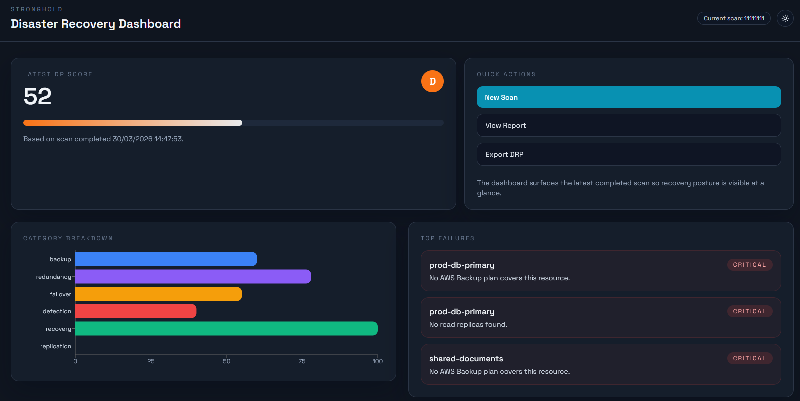
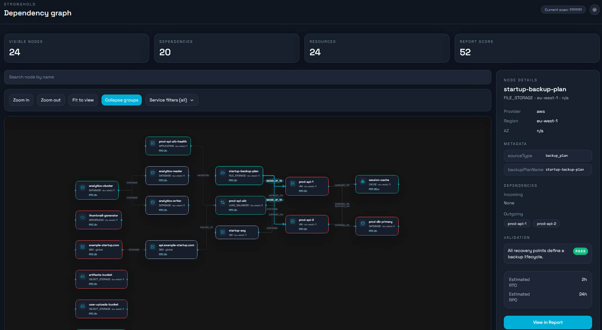

[](https://github.com/mehdi-arfaoui/stronghold/actions/workflows/ci.yml)
[](https://www.npmjs.com/package/@stronghold-dr/cli)
[](https://www.gnu.org/licenses/agpl-3.0)
[](https://www.typescriptlang.org/)

# Stronghold

**The first open-source disaster recovery automation platform for cloud infrastructure.**

Your disaster recovery plan is dead. Stronghold makes it alive.

<p align="center">
  
</p>


### Web UI

<p align="center">
  
</p>

<p align="center">
  
</p>

## The Problem

Most companies have a disaster recovery plan buried in a 50-page Word document that no one maintains.
When infrastructure changes - and it changes constantly - the plan becomes stale within weeks.
When disaster strikes, teams discover their plan is fiction.

**The result:** longer outages, more data loss, and a lot of finger-pointing in the post-mortem.

## What Stronghold Does

Stronghold connects to your cloud infrastructure, discovers every resource and dependency,
and automatically generates a disaster recovery plan you can version in Git.

- 🔍 **Auto-discovery** - Scans 16 AWS services, maps every dependency, finds single points of failure
- 📊 **DR Posture Score** - Weighted score across 6 DR categories: backup, redundancy, failover, detection, recovery, replication
- 📋 **DRP-as-Code** - Generates a YAML disaster recovery plan with recovery order, strategies, and honest RTO/RPO estimates
- 🔄 **Drift Detection** - Compares scans over time to detect when your DR posture degrades
- ⚡ **Honest RTO/RPO** - Documents what AWS confirms, says "requires testing" when no reliable estimate exists
- 🏗️ **Dependency Graph** - Visualizes blast radius: "if this node fails, these 12 services go down"

## Quick Start

**Try it in 10 seconds - no AWS credentials needed:**

```bash
npx @stronghold-dr/cli demo
```

**Scan your real infrastructure:**

```bash
npx @stronghold-dr/cli scan --region eu-west-1
npx @stronghold-dr/cli report
npx @stronghold-dr/cli plan generate > drp.yaml
```

**Or install globally:**

```bash
npm install -g @stronghold-dr/cli
stronghold scan --region eu-west-1
```

**Generate the minimal IAM policy you need:**

```bash
stronghold iam-policy > stronghold-policy.json
```

> 🔒 **Read-only.** Stronghold never modifies your infrastructure. Zero telemetry. Zero data sent anywhere.

Want the full walkthrough? Start with [docs/getting-started.md](docs/getting-started.md).

## How Stronghold Compares

| Feature | Stronghold | Velero | AWS Resilience Hub | Zerto | CloudEndure |
|---------|-----------|--------|-------------------|-------|-------------|
| Open-source | ✅ AGPL-3.0 | ✅ Apache-2.0 | ❌ | ❌ | ❌ |
| Auto-discovery | ✅ 16 services | ❌ K8s only | ✅ AWS only | ❌ | ❌ |
| Dependency graph | ✅ | ❌ | Partial | ❌ | ❌ |
| DRP-as-Code (YAML) | ✅ | ❌ | ❌ | ❌ | ❌ |
| Blast radius analysis | ✅ | ❌ | ❌ | ❌ | ❌ |
| Drift detection | ✅ | ❌ | Partial | ❌ | ❌ |
| Honest RTO | ✅ | N/A | Partial | ❌ | ❌ |
| Multi-cloud | AWS (Azure planned) | K8s | AWS only | Multi | AWS only |
| Self-hosted | ✅ Docker | ✅ | N/A | ❌ | N/A |
| Cost | Free | Free | AWS pricing | $$$$$ | AWS pricing |

## Architecture

```text
┌─────────────────────────────────────────────┐
│                  CLI / Web UI               │
├─────────────────────────────────────────────┤
│                @stronghold-dr/core          │
│  ┌──────────┐  ┌──────────┐  ┌───────────┐ │
│  │ Scanners │  │  Graph   │  │    DRP    │ │
│  │  AWS     │  │  Engine  │  │ Generator │ │
│  │  Azure * │  │  (SPOF,  │  │ (YAML,    │ │
│  │          │  │  blast)  │  │  RTO/RPO) │ │
│  └──────────┘  └──────────┘  └───────────┘ │
│  ┌──────────┐  ┌──────────┐  ┌───────────┐ │
│  │  Drift   │  │ Validat° │  │  Scoring  │ │
│  │ Detector │  │  Engine  │  │ (weighted)│ │
│  └──────────┘  └──────────┘  └───────────┘ │
├─────────────────────────────────────────────┤
│            Ports & Adapters                 │
│   (Prisma, File Store, Console Logger)      │
└─────────────────────────────────────────────┘
                * Azure: scanner skeleton, coming soon
```

Monorepo structure:

- `packages/core` - Pure business logic, zero framework dependencies
- `packages/cli` - CLI entry point for the community
- `packages/server` - Express API for the web UI
- `packages/web` - React frontend with dependency graph visualization

## CLI Commands

| Command | Description |
|---------|-------------|
| `stronghold scan` | Scan AWS infrastructure (default region from env) |
| `stronghold scan --region eu-west-1,us-east-1` | Scan specific regions |
| `stronghold scan --all-regions` | Scan all active AWS regions |
| `stronghold scan --services rds,aurora,s3` | Scan specific services only |
| `stronghold report` | Display the full DR posture report |
| `stronghold report --category backup` | Filter by DR category |
| `stronghold report --format markdown` | Export as Markdown |
| `stronghold plan generate` | Generate DRP-as-Code (YAML) |
| `stronghold plan validate --plan drp.yaml` | Validate plan against current infra |
| `stronghold drift check` | Detect DR posture drift between scans |
| `stronghold demo` | Run with sample infrastructure (no AWS needed) |
| `stronghold iam-policy` | Generate minimal IAM policy for scanning |

All commands support `--verbose` and `--help`.

Security-related CLI options:

- `--encrypt` encrypts sensitive local artifacts such as saved scans, DR plans, and drift baselines.
- `--redact` masks ARNs, IPs, and common AWS identifiers in generated output.
- audit logging is always enabled and written to `.stronghold/audit.jsonl`.

## Self-Hosted (Docker)

Run the full platform (API + Web UI + PostgreSQL):

```bash
git clone https://github.com/mehdi-arfaoui/stronghold.git
cd stronghold
cp .env.example .env
# Edit .env: set DB_PASSWORD and AWS credentials
docker compose up -d
```

Open `http://localhost:8080` for the web UI.

See [.env.example](.env.example) for all configuration options including AWS credential setup.

> 🔒 Generate the minimal read-only IAM policy: `stronghold iam-policy`

## Security

Stronghold includes three built-in security layers for scan artifacts and report sharing:

- Encryption: local CLI outputs can be written with `--encrypt`, and the server can encrypt scan data when `STRONGHOLD_ENCRYPTION_KEY` is set.
- Redaction: `--redact` masks ARNs, IPs, and common AWS identifiers in generated output and server reports.
- Audit trail: the CLI writes `.stronghold/audit.jsonl`, and the server persists audit events in `AuditLog` with `GET /api/audit`.

See [docs/security.md](docs/security.md) for the threat model, storage model, and deployment guidance.

## Documentation

- [Getting Started](docs/getting-started.md)
- [Architecture](docs/architecture.md)
- [Security Model](docs/security.md)
- [Licensing FAQ](docs/licensing-faq.md)
- [DRP Specification](docs/drp-spec.md)
- [AWS Provider](docs/providers/aws.md)
- [Validation Rules](docs/validation-rules.md)
- [Scoring](docs/scoring.md)
- [Self-Hosted Deployment](docs/self-hosted.md)

## What You Get

```text
DR Posture Score
Score: 52/100 (Grade: D)

Score by Category
Backup        60/100 ############........
Redundancy    78/100 ################....
Failover      55/100 ###########.........
Detection     40/100 ########............
Recovery     100/100 ####################
Replication    0/100 ....................

Critical Failures
critical backup_plan_exists - prod-db-primary
No AWS Backup plan covers this resource.
Impact: 2 services depend directly on this resource.
Remediation: Attach the resource to an AWS Backup plan.

critical rds_replica_healthy - prod-db-primary
No read replicas found.
Impact: 2 services depend directly on this resource.
Remediation: Create at least one healthy read replica for the primary instance.

High Failures
high cloudwatch_alarm_exists - prod-db-primary
No CloudWatch alarm targets this resource.
Impact: 2 services depend directly on this resource.
Remediation: Create at least one CloudWatch alarm to reduce detection time during incidents.

Warnings
No warnings.

Methodology
Weighted by rule severity x node criticality x blast radius (log2, direct dependents only)
This score measures the percentage of recommended DR mechanisms in place, weighted by severity and impact. It does not guarantee recovery capability - only a tested DR plan can provide that assurance.
```

## What's in a Scan Result

Scan results are stored locally in `.stronghold/latest-scan.json` by default, or in `.stronghold/latest-scan.stronghold-enc` when `--encrypt` is used. They contain:

- **Included:** Resource ARNs, configuration metadata (backup settings, AZ placement, replication status), dependency maps, DR validation results
- **Never included:** AWS credentials, secrets, application data, database contents, customer data

Scan results contain infrastructure topology information. Review before sharing or committing to version control.

## Roadmap

- [x] AWS scanner (16 services including Aurora, EFS, Route53, CloudWatch)
- [x] Dependency graph with SPOF and blast radius analysis
- [x] DRP-as-Code - YAML generation with topological recovery order
- [x] DR validation engine with weighted posture scoring
- [x] Honest RTO/RPO with documented AWS sources
- [x] Drift detection
- [x] CLI with demo mode and IAM policy generator
- [x] Self-hosted Docker deployment
- [x] Web UI with interactive dependency graph
- [x] Executable DRP (generate runbooks with AWS CLI commands)
- [ ] Azure scanner (skeleton in place)
- [ ] GCP scanner
- [ ] Continuous drift monitoring (cloud feature)
- [ ] Restore testing with measured RTO
- [ ] PDF board-ready reports
- [ ] NIS2 / DORA compliance mapping
- [ ] Slack / PagerDuty integration

## Contributing

Contributions welcome! See [CONTRIBUTING.md](CONTRIBUTING.md) for development setup and guidelines.

```bash
git clone https://github.com/mehdi-arfaoui/stronghold.git
cd stronghold && npm install && npm run build && npm run test
```

## License

[AGPL-3.0](LICENSE) - free to use, modify, and self-host. If you modify and offer it as a service, you must open-source your changes.

Built with heart for the DevOps and SRE community.
